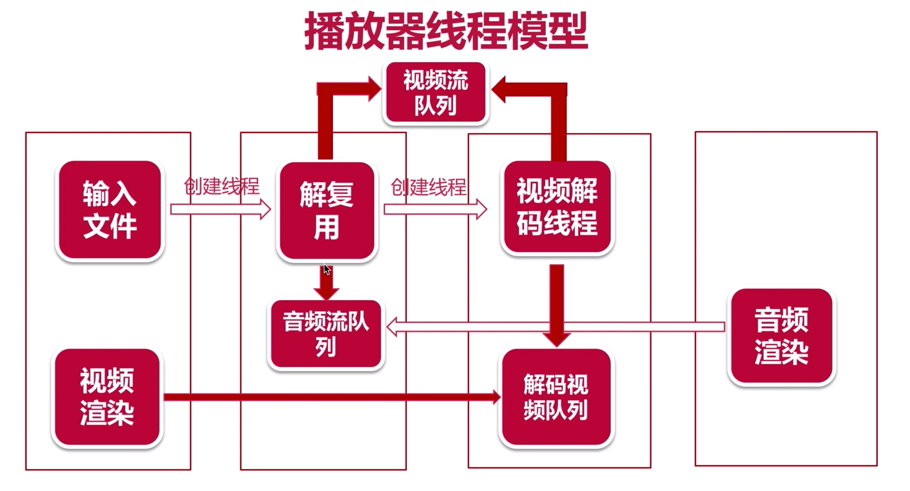

## 播放器线程模型

0.输入一个媒体文件[主线程]
1.解复用线程   ->  输入 ->  视频流队列(未解码) / 音频流队列
2.视屏解码线程  <-  取出  <-  视频流队列(未解码)
      ┃
      ┗━ 解码视频队列

3.音频渲染线程 (SDL提供)   <-  取出  <-  音频流队列(未解码)
      ┃
      ┗━ 音频解码 -> 渲染

4.渲染视频[主线程]

